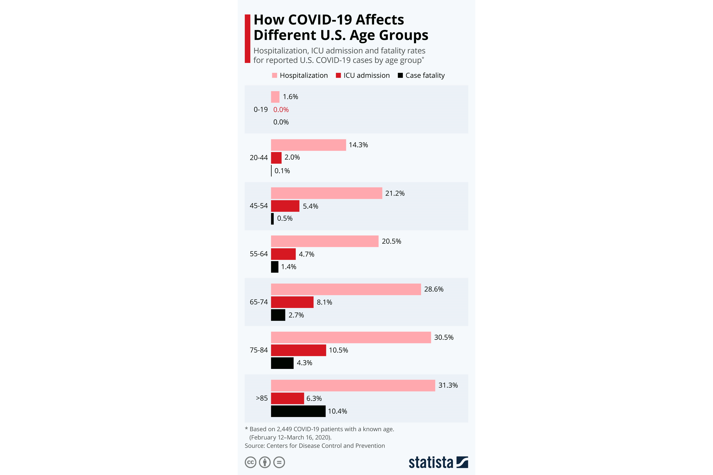
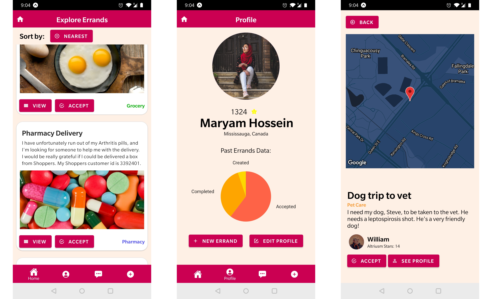

# TreeHacks 2021 & Hackthrob 2021
## Inspiration
The world came to an unforeseen halt after the COVID-19 outbreak began in late 2019. For more than one-and-a-half years, we have had to combat this pandemic by avoid contact with each other as much as possible. Because the COVID-19 virus is so immensely contagious, extreme lockdown measures seem to be the only efficient way to combat it.  

Analyzing the pattern of COVID-19 cases in the different demographics have shown us that senior citizens and people with underlying health conditions seem to be particularly vulnerable to this deadly virus. The reason for this is theorized to be the fact that the COVID-19 virus affects the lungs of its host, giving them symptoms such as fever, dry cough, tiredness.  

  
*Statista,* Niall McCarthy (2020). *[How COVID-19 Affects Different U.S. Age Groups](https://www.statista.com/chart/21173/hospitalization-icu-admission-and-fatality-rates-for-reported-coronavirus-cases/)*  

In aims of prioritizing the needs of the elderly and of those with underlying health conditions, I created ***Altruist***.
## What it does
***Altruist*** is a mobile application that promotes kindness and compassion among a community by assigning tasks and errands of senior citizens to younger, healthier people. Because COVID-19 is critical to the elderly, ***Altruist*** makes sure the elderly can stay indoors and promotes a culture of altruism by allowing the younger generation to take over their tasks.

The mobile application allows senior citizen users to post their errands to the public feed. The errands can be anything, from medicine deliveries to grocery orders. From there, the young users can pick it up and connect with them to complete that errand. Through these acts of kindness from the young users, the elderly population can have reduced exposure and interaction with others that may carry the virus, which seems the most efficient way to beat the virus.  

Click image below for demo video (or click [here](https://youtu.be/0xuxMHK1F9Y))  
  

In order to motivate the young adult population, ***Altruist*** also consists of a points system, through which you can gain "Altruism Stars". The application keeps track of a users completed errands and awards them with points which may be accumulated and later redeemed for a gift card from a retail store. Through this ***Altruist*** promotes a positive community of goodwill and generosity, where the young pay the elderly back for all their past sacrifices.  

## How I built it
The ***Altruist*** mobile application is built using **React Native**, with a **Django** application serving as a back-end with **Django REST framework** REST API set up. The application utilizes the **ArcGIS World Geocoding Service** to locate postal codes and the **Google Maps API** to visualize locations.

  

## Challenges I ran into
The biggest challenge of this hackathon was working alone. Working on both backend, frontend and pitching has been very hectic. 

## Accomplishments that I'm proud of and what I learned
This was my first solo hack in app development, and I'm really happy it went so well. I have only gotten into app development since last year, and I'm proud of the progress I've made. I'm also happy to know that I've managed to pull of an app that has the potential of helping many.

## What's next for ***Altruist***
The next step for ***Altruist*** would be to polish it. Additionally, I plan to host it using a hosting service.